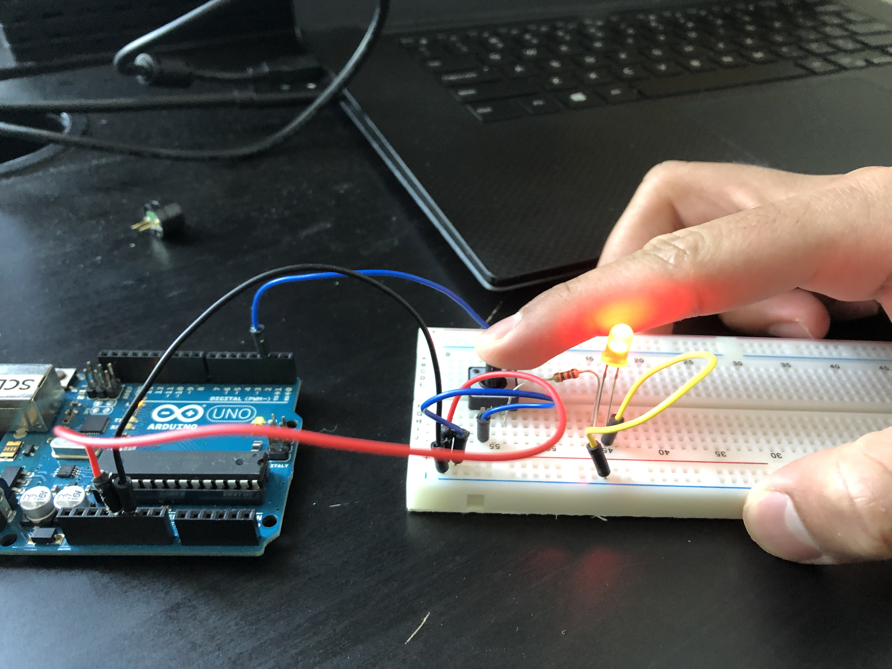
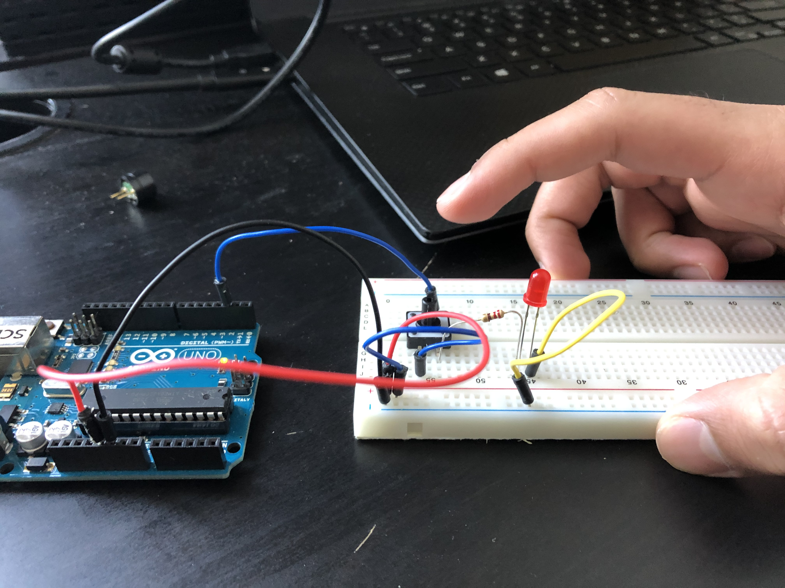

# Omar Zahir: ELectronics for the Rest of Us!
<!--
Welcome to your project page for Electronics for the Rest of Us. You'll use this page to describe and showcase your work throughout the module. 
A place for each deliverable has been created below for you in this markdown document. 
Note that comments (such as this) will not appear in the final markdown document (which you can view with the "Preview" button).
-->


## Day 1
<!--
In this section, provide a ~250 word reflection on your first day of the module, and discuss why you're interested in this module and what you hope to take away from it.

You're also asked to insert a photo that represents your accomplishments on your first day. 
- Take a photo of you working or one of your circuits and upload it to the /docs/images/ folder of this repository. 
- Then, insert your photo into your document by modifying the markdown example that has been inserted below.
-->
Prior to this course I had some experience with GitHub as I am in Computer Science and it is primarily used for uploading code. However, we were using the command line version of GitHub, so this was my first time interacting with GitHub on the web. Similarly, I was also not aware of the great resource also provided by GitHub, GitHub pages. Previously, any website or web development that I had done was through the HTML and CSS development tools, but thanks to GitHub Pages, I realize it is actually really easy and intuitive to set up a simple web page for a small task, not to mention the fact that it is hosted by GitHub so it's free. Similarly, I also had experience with Markdown as I was creating README files for some of my projects, but I did not know about all the interesting and intricate features like creating tables, embedding pictures and video, and even adding emoji!

As far as Arduino is considered, I am honestly blown away by the potential and creative possibilities. Me and my friends once used an Arduino for one of our science fair projects in high school but I did not actually get a chance to work on the Arduino part, and now I regret it big time. Being interested in coding, I always have a complaint about how the result of our code is hardly ever tangible, and we can't interact with it, but Arduino makes it possible to test and experiment with your code and see those results in the real world.

<!--
Inserting an image takes the form: 

See the following webpage for more information: https://github.com/adam-p/markdown-here/wiki/Markdown-Cheatsheet#images
Replace the elements below to insert your picture.
--> 



## Day 2
<!--
Upload your fully-commented Arduino sketch from your final Day 2 build task--a thermometer connected to an RDB LED--into your GitHub repository.
Provide a short (~150 words) summary of your work on this circuit:
- How does your device work?
- What was challenging? 
- What worked? What didn't? 
- Be sure to link to your code (in your GitHub repository) in the text of your response.
-->

The device uses the thermistor as an input for the temperature and does so by providing power to one end of the thermistor, and having the other end connected to both the ground and an input pin that will send the temperature data to the computer. Based on the reading, the computer will adjust the RGB LED colors which is connected to three other pins, each controlling one of the primary colors, which we already set up in the previous exercise.

I got stuck on this exercise for a bit because unlike for all the exercises prior, the circuit diagram was not graphical and was a bit unintuitive. While I understood most of it, the branching aspect of the diagram confused me, and to clarify the concept I had to view Dr. Jay's tutorial video, which made it very simple. I also learnt that the positive and negative rails on either side of the breadboard span only half the length, which is why I was getting NAN errors for a while.

This is the code:
[Thermometer Code](code/Thermometer_Code.ino "This is the Code!")
## Arduino build-off results
<!--
Upload your fully-commented Arduino sketch from the final product of your Arduino build-off into the top-level of your module GitHub repository.
In ~300 words, provide a final device description and product pitch: 
- What does it do? Use a table (created in markdown) to list and describe the features. You can use the template provided below. 
- Describe briefly how it works.
- How could it be used in everyday life (or maybe just in rare cases)? 
- Be sure to link to your code (in your GitHub repository) in the text of your response.
- Include a snippet of code using the ``` ``` characters to display the code properly. 
Finally, record a short (30 second) video of a 'product pitch' for your device. 
- Upload the video to Youtube, and use the sample code below to embed your video.
-->
### Project Description and Code Overview
For my final project, I decided to make a game that mimics those found in arcades, with the the lights flashing around in a large circle, and you have to click the button at the right time.

| Feature | Description | Code Overview |
|---------|-------------|-------------|
| LED     |The LED flash one after another based on the speed, and tapping on the blue one is the objective. It is more intricate then just flashing, however, because on a correct press, when it is at blue, all the lights flash twice quickly, and if it was not blue, then the light at which it was presses flashes twice individually. |The code works by simply turning on one LED, letting it flash for a specific amount of delay, and then closing it and letting the other flash. On a correct response, all the LED flash twice, but on an incorrect response, only the incorrect is flashed.             |
|Potentiometer         | Perhaps the coolest feature is the potentiometer, which varies the speed at which the LED flash, in other words, changing the difficulty of the game.             |The delay is determined at the starting of every loop by the potentiometer value, which is then stored in a variable and called by the delay function.             |
|Button         |I have also set up the button, which is used to select the color by pressing the button when that color is flashing.             |Between each LED flash and close, the program checks for whether the button is pressed, and if so, depending on the color, it either flashes an individual light or all the lights, and plays the correct or incorrect buzzer sound.             |
|Buzzer         |The buzzer is set up to indicate the correct and wrong press, with distinct sounds for each. The correct is higher frequncy and the incorrect is lower, but both are the same suration of half a second.             |Their are two distinct buzzer sounds, the correct one being at a higher frequency then the incrrect one. In the code it is located in the same desicion statement for the button presses.

### Purpose and Potential uses
As this is created to be a game, it can be used by almost anyone for entertainment purposes, especially in the time of COVID-19 where everyone is locked at home, and bored out of their minds. I also think my game has other applications like skill testing for reflexes, and friendly competitions that can be hosted to determine who is more skillful. Since the game is also so easy to set up and requires very basic sensors, virtually anyone with an arduino can set it up in no time and get playing!

### Code Snippet
Since my code is quite repetitive, this snippet of code explains mostly how all the things play out, and the descriptions for the code is described above.

Code:
```
  digitalWrite(led3, LOW);      // turn the LED off by making the voltage LOW
  // Flash light Green
  digitalWrite(led4, HIGH);     // turn the LED on (HIGH is the voltage level)
  delay(t/2);                      // wait for 1/2 a second
  buttonState = digitalRead(buttonPin); // read the state of the pushbutton value:
  if (buttonState == HIGH) {     // check if the pushbutton is pressed. If it is, the buttonState is HIGH
    tone(buzzerPin, 100, 500);  // Incorrect Buzzer
    // Flash Light Green
    digitalWrite(led4, HIGH);
    delay(200);
    digitalWrite(led4, LOW);
    delay(200);
    digitalWrite(led4, HIGH);
    delay(200);
    digitalWrite(led4, LOW);
  }
  delay(t/2);                      // wait for 1/2 a second
  digitalWrite(led4, LOW);      // turn the LED off by making the voltage LOW
  // Flash light Blue
  digitalWrite(led5, HIGH);     // turn the LED on (HIGH is the voltage level)
```

<!--
Below is a general markdown table template. 
You can find more information at these links: 
- https://github.com/adam-p/markdown-here/wiki/Markdown-Cheatsheet#tables

-->

<!--
Below is an example of embedding a YouTube video in a markdown document for use in GitHub pages. 
Note that this video won't show when previewing the document in GitHub--it only works on the GitHub pages webpage. 
- Once your YouTube video is uploaded, right click and select ```<> Copy embed code```. 
- You can paste this code directly into your markdown document. 
- Note that you may want to adjust the width and height parameters to make it fit well in your webpage
-->

<iframe width="560" height="315" src="https://www.youtube.com/embed/roVPfdigTYc" frameborder="0" allow="accelerometer; autoplay; encrypted-media; gyroscope; picture-in-picture" allowfullscreen></iframe>

## Final reflection & summary
<!--
In ~300 words:
- Summarize your experience in this module. What you learned, what you liked, what you found challenging.
- Reflect upon your learning and its relevance in your life.
-->

If I am being honest, this module greatly exceeded my expectations and I was blown away by how fun and useful it was. I was very impressed by how everything was mailed to us and in such a neat and cleanly manner. As for the course, content itself, I found it very exciting and there was never a dry moment. I found the content and instructions to be quite intuitive and easy to follow, with the diagrams and code snippets being very understandable for a beginner to robotics like me, and in the places where I did get stuck, I just referred to your explanatory videos which usually solved the problem.

I chose this module in the first place for mainly two reasons. My biggest reason was probably my curiosity because, as I mentioned earlier, I have had some exposure to Arduino, but I never got a chance to use it, and since this module required little to no prior knowledge, I thought it would be a perfect opportunity to get my foot through the door. The second supporting reason was that, being in computer science, I thought I would be a step ahead when it came to the coding aspect. Sure enough, my prior knowledge with coding and GitHub turned out to be very useful.  That being said, I still learnt a lot about the Arduino language, and certain aspects of the language that are unique to the platform which I never encountered before, like the delay function.

The final project was a fitting conclusion to the end of the module and I honestly felt very empowered by seeing a fully fleshed out game that I created from scratch, worthy of being played. As I said before, this module has been amazing, but also very practical for me in a career sense because it has allowed me to embrace a whole other side of computer science that I never really acknowledged, robotics, and it could prove to be a potential career path in the future. The solution to my complaint about coding being only virtual has finally been answered and I can honestly see myself using Arduino, and robotics in general, seriously in my future, both in recreation and professionally.
